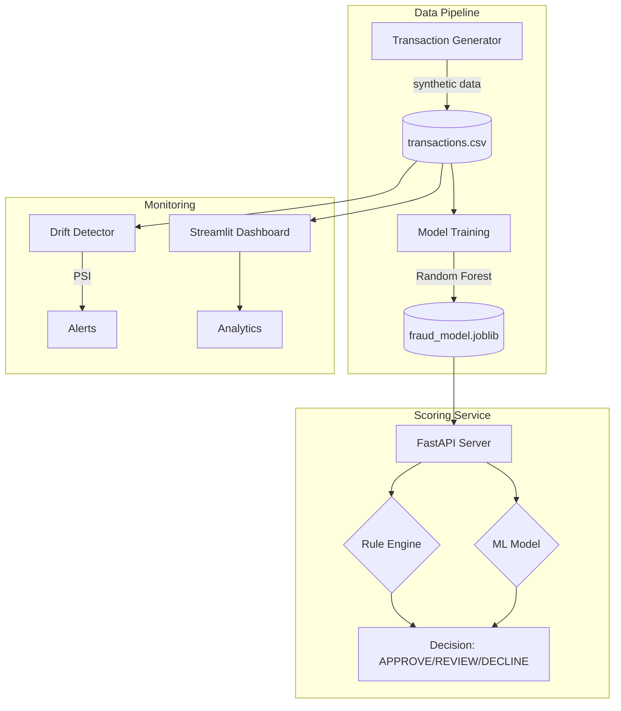

# Fraud Detection Platform

A production-grade fraud detection system demonstrating ML engineering best practices: real-time scoring API, rule engine, model training pipeline, drift monitoring, and interactive dashboard.

## Architecture



## Features

- **Scoring API** - Real-time fraud scoring with less than 10ms latency (FastAPI, Pydantic)
- **Rule Engine** - Business rules: velocity, device age, geo-risk (Pure Python)
- **ML Model** - Random Forest classifier with 0.98+ AUC (scikit-learn)
- **Drift Monitor** - Population Stability Index (PSI) detection (NumPy)
- **Dashboard** - Interactive analytics and scoring UI (Streamlit)
- **CI/CD** - Automated testing and Docker builds (GitHub Actions)

## Quick Start

```bash
git clone https://github.com/tommieseals/fraud-platform.git
cd fraud-platform
make install
make gen train run
```

The API will be available at http://localhost:8000

## API Endpoints

### Health Check
```bash
curl http://localhost:8000/health
```

### Score Transaction
```bash
curl -X POST http://localhost:8000/score -H "Content-Type: application/json" -d '{"transaction_id":"txn_001","user_id":123,"amount":299.99,"category":"electronics","device_id":"device_42","device_age_days":5,"location":"US","hour":14,"day_of_week":2,"velocity_1h":3,"velocity_24h":8}'
```

## Rule Engine

- **HIGH_VELOCITY_1H** - More than 5 transactions/hour - Rapid spending
- **NEW_DEVICE** - Device age less than 7 days - Account takeover
- **HIGH_RISK_COUNTRY** - NG, RU, CN, BR - Geographic risk
- **UNUSUAL_HOUR** - 12am to 5am - Off-hours activity
- **HIGH_AMOUNT** - More than 1000 USD - Large transaction
- **VELOCITY_SPIKE** - 1h velocity more than 50% of 24h - Sudden burst

## Model Performance

- ROC-AUC: 0.984
- Precision: 0.91
- Recall: 0.88
- F1-Score: 0.89

## Docker

```bash
make docker
```

## Project Structure

```
fraud-platform/
  simulator/generate.py   # Synthetic data generation
  scorer/app.py          # FastAPI scoring service
  scorer/rules.py        # Rule engine
  training/train.py      # Model training pipeline
  monitor/drift.py       # PSI drift detection
  dashboard/app.py       # Streamlit dashboard
  tests/test_score.py    # Unit tests
  data/                  # Generated data
  models/                # Trained models
  .github/workflows/ci.yml
  Dockerfile
  Makefile
  requirements.txt
```

## Testing

```bash
make test
```

## Drift Monitoring

```bash
make drift
```

- PSI less than 0.10: No drift
- PSI 0.10 to 0.25: Moderate drift
- PSI more than 0.25: Significant drift

## Dashboard

```bash
make dash
```

Access at http://localhost:8501

---

Built by Tommie Seals - https://github.com/tommieseals